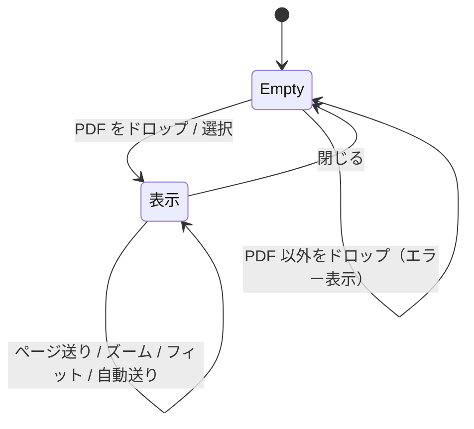

# UI 仕様

単一画面（SPA）で、開いているファイルの有無により **Empty（ドロップ待ち）／表示** を切り替える。

## 画面遷移図

## 表示状態

| 状態 | 表示内容 |
|------|---------|
| Empty | 未読込時。中央に「PDF をここにドラッグ＆ドロップ / クリックして選択」案内 |
| Loading | PDF 読み込み中は「読み込み中…」を表示 |
| 表示 | PDF を描画。上部にツールバーを表示 |
| Error | PDF 以外の選択・読み込み失敗時にエラーメッセージを表示 |

## 機能挙動仕様（契約）

### ファイル読み込み

- ドラッグ＆ドロップで PDF を開ける。クリックによるファイル選択でも開ける（`accept="application/pdf"`）
- PDF 以外のファイルは拒否し、エラーメッセージを表示する
- 読み込み失敗時はエラーメッセージを表示する
- ドラッグ中はドロップ領域をハイライトする

### ページ操作

- 前 / 次ページに移動できる（ツールバーのボタン、`←`/`PageUp` = 前、`→`/`PageDown` = 次）
- ページ範囲は 1〜総ページ数にクランプされる（範囲外に移動しない。端ではボタンを disabled）
- フォーム要素（`input` / `textarea` / `select`）にフォーカスがある場合はキーボード操作を無視する

### ズーム

- 拡大 / 縮小できる（0.5〜3.0 倍、0.2 刻み）
- 現在倍率を表示し、クリックで 100% にリセットできる

### フィット表示（幅に合わせる / 高さに合わせる）

- 「幅に合わせる」: ページ幅を表示領域の幅に自動で合わせる（縦に長いページは縦スクロール）
- 「高さに合わせる」: ページ高さを表示領域の高さに自動で合わせる（横が広いページは横スクロール）
- 2つのフィットは排他（各トグルで切替、同じボタン再押下で解除）
- ウィンドウ / コンテナのリサイズに追従する
- 手動ズーム（＋/−/リセット）操作時はフィットを解除し、手動倍率に切り替わる
- ファイルを開いた直後は「幅に合わせる」をデフォルトとする

### 自動ページ送り（スライドショー）

- 再生 / 停止をトグルできる。送り間隔を選択できる（1 / 2 / 3 / 5 / 10 秒）
- 再生中は間隔ごとに次ページへ自動遷移し、最終ページで自動停止する
- 最終ページで再生開始した場合は先頭ページに戻ってから再生する

### その他

- 開いているファイルを閉じ、初期（ドロップ待ち）状態へ戻れる

## UI 規約

- 配色はダークテーマ。色は CSS 変数（`--bg` / `--panel` / `--border` / `--text` / `--accent`）で管理する
- クリック可能要素は `<button type="button">` を用いる（div への `onClick` は避ける）
- ドラッグ＆ドロップ領域はキーボード代替としてクリックでのファイル選択を必ず用意する
- アイコンは絵文字・記号で簡潔に表現する（追加の依存を持たない）
