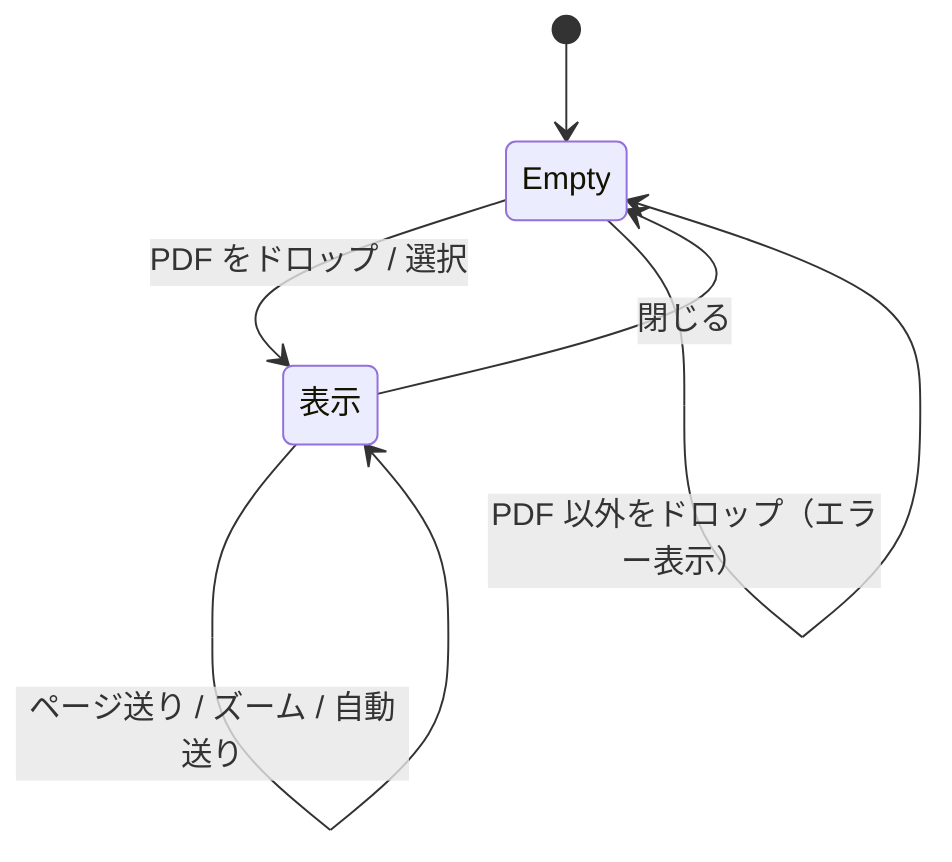

# UI 仕様

## 画面一覧

| 画面 | 状態 | 説明 |
|------|------|------|
| ビュワー画面 | Empty | ファイル未読込。中央にドロップ案内を表示 |
| ビュワー画面 | 表示 | PDF を描画。上部にツールバーを表示 |

単一画面（SPA）で、`file` の有無により Empty / 表示を切り替える。

## 画面遷移図



## 画面機能仕様

### ツールバー（表示時のみ）

| 要素 | 機能 |
|------|------|
| ファイル名 | 現在開いているファイル名を表示 |
| `‹` / `›` | 前ページ / 次ページ（端で disabled） |
| `n / N` | 現在ページ / 総ページ数 |
| `−` / 現在倍率 / `＋` | 縮小 / 現在倍率（例: `120%`。クリックで 100% にリセット）/ 拡大 |
| `▶ 自動送り` / `⏸ 停止` | 自動ページ送りのトグル |
| 間隔セレクト | 送り間隔（1/2/3/5/10 秒） |
| `✕ 閉じる` | 初期状態へ戻る |

### キーボード操作（表示時のみ）

| キー | 動作 |
|------|------|
| `←` / `PageUp` | 前ページ |
| `→` / `PageDown` | 次ページ |

入力欄（`input` / `textarea`）にフォーカスがある場合はキーボード操作を無視する。

## 各画面の表示状態

| 状態 | 表示内容 |
|------|---------|
| Loading | PDF 読み込み中は「読み込み中…」を表示 |
| Empty | 未読込時は「PDF をここにドラッグ＆ドロップ / クリックして選択」案内 |
| Error | PDF 以外の選択・読み込み失敗時にエラーメッセージ（`app__error`）を表示 |

## レイアウト構成

```
┌───────────────────────────────────┐
│ Toolbar（表示時のみ）              │
├───────────────────────────────────┤
│ （エラー時）エラーバー             │
├───────────────────────────────────┤
│                                   │
│   DropZone                        │
│     Empty: ドロップ案内           │
│     表示 : PdfViewer（ページ描画）│
│                                   │
└───────────────────────────────────┘
```

## コンポーネント一覧

| コンポーネント | 役割 |
|---------------|------|
| `App` | レイアウト、状態の親、キーボード / 自動送りの副作用 |
| `DropZone` | ドラッグ＆ドロップ受け口、ファイル選択、ドラッグ中のハイライト |
| `Toolbar` | ページ送り・ズーム・自動送り・閉じる操作 |
| `PdfViewer` | react-pdf の `Document` / `Page` で描画 |

## UI 規約

- 配色はダークテーマ。色は CSS 変数（`--bg` / `--panel` / `--border` / `--text` / `--accent`）で管理する
- クリック可能要素は `<button type="button">` を用いる（div への `onClick` は避ける）
- ドラッグ＆ドロップ領域はキーボード代替としてクリックでのファイル選択を必ず用意する
- アイコンは絵文字・記号で簡潔に表現する（追加の依存を持たない）
