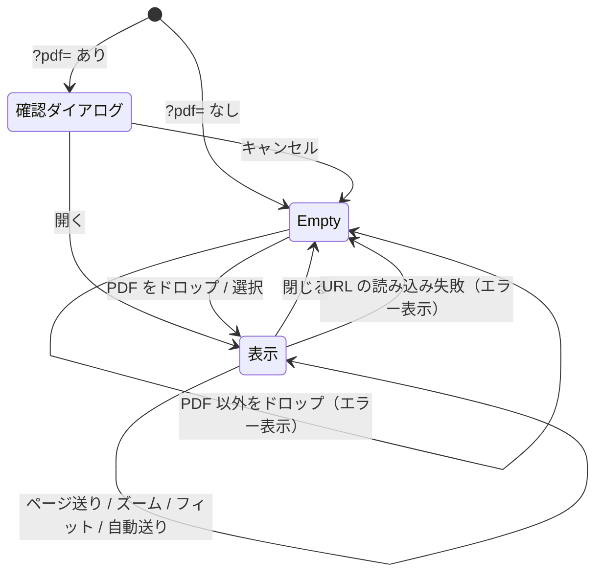

# UI 仕様

単一画面（SPA）で、開いているファイルの有無により **Empty（ドロップ待ち）／表示** を切り替える。

## 画面遷移図

```mermaid
stateDiagram-v2
    [*] --> Empty: ?pdf= なし
    [*] --> 確認ダイアログ: ?pdf= あり
    確認ダイアログ --> 表示: 開く
    確認ダイアログ --> Empty: キャンセル
    Empty --> 表示: PDF をドロップ / 選択
    表示 --> 表示: ページ送り / ズーム / フィット / 自動送り
    表示 --> Empty: 閉じる
    表示 --> Empty: URL の読み込み失敗（エラー表示）
    Empty --> Empty: PDF 以外をドロップ（エラー表示）
```

## 表示状態

| 状態 | 表示内容 |
|------|---------|
| Empty | 未読込時。中央に「PDF をここにドラッグ＆ドロップ / クリックして選択」案内 |
| Loading | PDF 読み込み中は「読み込み中…」を表示 |
| 表示 | PDF を描画。上部にツールバーを表示 |
| Error | PDF 以外の選択・読み込み失敗時にエラーメッセージを表示 |
| 確認ダイアログ | `?pdf=` 指定時。取得元の承認を求めるモーダルを表示 |

## 機能挙動仕様（契約）

### ファイル読み込み

- ドラッグ＆ドロップで PDF を開ける。クリックによるファイル選択でも開ける（`accept="application/pdf"`）
- PDF 以外のファイルは拒否し、エラーメッセージを表示する
- 読み込み失敗時はエラーメッセージを表示する
- ドラッグ中はドロップ領域をハイライトする

### URL パラメータでの読み込み（`?pdf=`）

クエリパラメータ `?pdf=<PDF の URL>` で、起動時に開く PDF を指定できる。

**契約**

- 受け付けるのは `http:` / `https:` の絶対 URL のみ。それ以外のスキーム（`javascript:` / `data:` / `file:` 等）・URL として解釈できない値は拒否し、エラーメッセージを表示する（ダイアログは出さない）
- パラメータ未指定・空の場合は従来どおり Empty 状態で起動する
- 表示できるのは配信元が CORS を許可している PDF に限る。`Access-Control-Allow-Origin` を返さないサーバーの PDF はブラウザが読み込みをブロックするため取得できない
- ファイル名は URL のパス末尾から導出する（`Content-Disposition` は CORS 越しに読めないため）。末尾にファイル名がない場合は `document.pdf` とする
- 拡張子では PDF 判定を行わない（拡張子なしで PDF を配信するホストがあるため）。PDF として読めるかは読み込み結果で判断する

**確認ダイアログ**

- パラメータを無検証で自動読み込みせず、必ず確認ダイアログで承認を求める（第三者が作成したリンクにより、本サイトの画面内で任意の PDF を開かせられることを防ぐ）
- 取得元のオリジンを主として表示し、URL 全体は副次的に表示する（長い URL による表示偽装を防ぐ）
- 事前に HEAD リクエストで `Content-Length` を取得し、ダウンロードサイズを表示する。取得できない場合は「不明」として続行する
- 「開く」で読み込みを開始し、「キャンセル」および Esc で Empty 状態へ戻る

**読み込み中・失敗時**

- 読み込み中は進捗（%）を表示する。総バイト数が不明な間は「読み込み中…」のみ表示する
- 読み込みに失敗した場合は、原因が配信元にある可能性を示すメッセージと、当該 URL を新しいタブで開く導線を表示する（ダウンロード後にドロップする従来フローへ誘導する）
- 失敗後は Empty 状態へ戻し、ドロップでの読み込みを継続できる

### ページ操作

- 前 / 次ページに移動できる（ツールバーのボタン、`←`/`PageUp` = 前、`→`/`PageDown` = 次）
- ページ範囲は 1〜総ページ数にクランプされる（範囲外に移動しない。端ではボタンを disabled）
- フォーム要素（`input` / `textarea` / `select`）にフォーカスがある場合はキーボード操作を無視する

### ズーム

- 拡大 / 縮小できる（0.5〜3.0 倍、0.2 刻み）
- 現在倍率を表示し、クリックで 100% にリセットできる

### フィット表示（幅に合わせる / 高さに合わせる）

- 「幅に合わせる」: ページ幅を表示領域の幅に自動で合わせる（縦に長いページは縦スクロール）
- 「高さに合わせる」: ページ高さを表示領域の高さに自動で合わせる（横が広いページは横スクロール）
- 2つのフィットは排他（各トグルで切替、同じボタン再押下で解除）
- ウィンドウ / コンテナのリサイズに追従する
- 手動ズーム（＋/−/リセット）操作時はフィットを解除し、手動倍率に切り替わる
- ファイルを開いた直後は「幅に合わせる」をデフォルトとする

### 自動ページ送り（スライドショー）

- 再生 / 停止をトグルできる。送り間隔を選択できる（1 / 2 / 3 / 5 / 10 秒）
- 再生中は間隔ごとに次ページへ自動遷移し、最終ページで自動停止する
- 最終ページで再生開始した場合は先頭ページに戻ってから再生する

### その他

- 開いているファイルを閉じ、初期（ドロップ待ち）状態へ戻れる

## UI 規約

- 配色はダークテーマ。色は CSS 変数（`--bg` / `--panel` / `--border` / `--text` / `--accent`）で管理する
- クリック可能要素は `<button type="button">` を用いる（div への `onClick` は避ける）
- ドラッグ＆ドロップ領域はキーボード代替としてクリックでのファイル選択を必ず用意する
- アイコンは絵文字・記号で簡潔に表現する（追加の依存を持たない）
- モーダルは `<dialog>` を用いる（フォーカストラップ・Esc での閉じる挙動をブラウザに委ねる）
